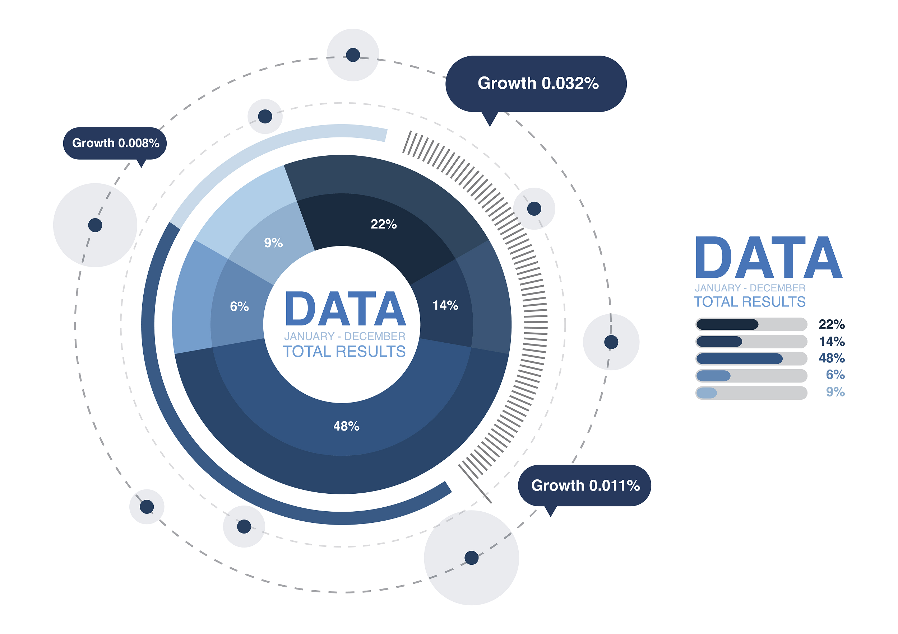

## 👋 Hi there!

🧑 Com uma sólida formação em Ciências da Computação pela Universidade Mogi das Cruzes e mais de 28 anos de experiência na área, desenvolvi uma especialização em sistemas de informação, modelagem de dados e otimização de banco de dados. Minha atuação é marcada por uma forte competência em análise e integração de dados, além de business intelligence, com foco em transformar dados brutos em informações estratégicas e insights acionáveis.

Ao longo da minha carreira, adquiri vasta experiência em setores como educação, metalurgia, consultoria, manufatura e bancário, aplicando ferramentas como Python e SQL para análise de grandes volumes de dados.
Essa experiência me permitiu identificar tendências, realizar análises preditivas e fornecer bases concretas para a tomada de decisões estratégicas. A minha abordagem, centrada na resolução de problemas e na otimização de processos, resultou em ganhos expressivos de desempenho para diversas organizações.

💻 Entre minhas principais habilidades estão:

* Manipulação e análise de dados complexos utilizando ferramentas como Python, SQL e Power BI;
* Desenvolvimento de visualizações avançadas de dados, criação de dashboards interativos e elaboração de relatórios detalhados;
* Aplicação de modelagem estatística e machine learning para previsões de negócios e análises aprofundadas;
* Identificação de KPIs e oportunidades de melhoria contínua;
* Apoio à tomada de decisões estratégicas por meio da implementação de soluções que promovem a eficiência operacional e impulsionam o crescimento empresarial.

🎯 Meu perfil é orientado a resultados e pautado por uma mentalidade analítica, sempre comprometido com a maximização do valor dos dados para o sucesso das organizações.
