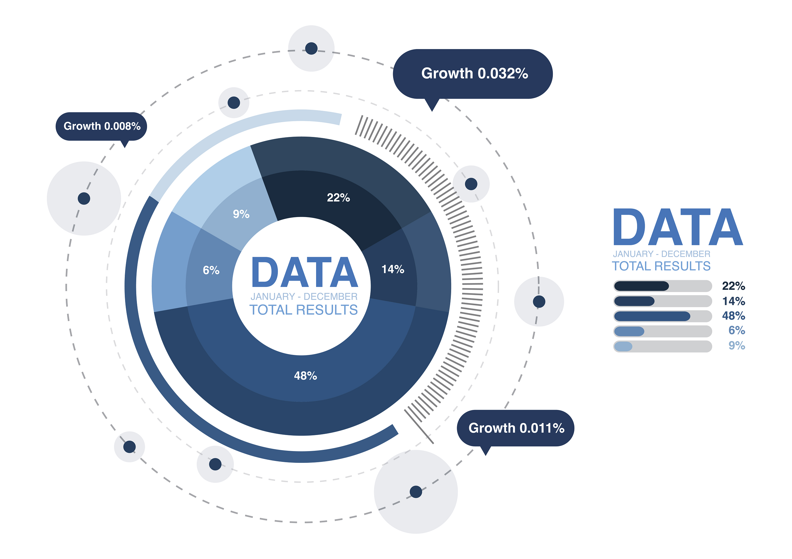

## 👋 Hi there!

🧑 Profissional de tecnologia com mais de 28 anos de experiência estruturando, processando, analisando e transformando dados em ambientes corporativos complexos. Possuo sólida experiência na transformação de dados em insights acionáveis, com histórico comprovado na otimização de processos, melhoria de desempenho e suporte à tomada de decisão baseada em dados.

🎯 Ao longo da minha trajetória, utilizei bancos de dados, SQL, modelagem, integração e análise de informações para resolver problemas de negócio em setores como educação, indústria, consultoria e mercado financeiro. Complementando essa experiência, aprofundei meus conhecimentos em Estatística, Python, Machine Learning e Power BI, consolidando minha atuação em Data Analytics, desenvolvendo soluções orientadas por dados e modelos analíticos para geração de valor ao negócio.

⚙ Skills:

Análise de Dados | Machine Learning | Python | Matplotlib | SQL | Pandas | Jupyter Notebook | Numpy | Visualização de Dados | Análise 
Exploratória de Dados | Banco de Dados | Power BI | Estatística | ETL | Modelagem de Dados

🧐 Você pode me acompanhar:

